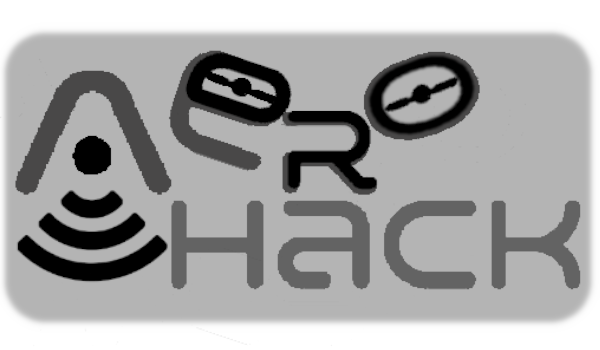

# AeroHack

## Narzędzie służące do badania do badania bezpieczénstwa bezzałogowych statków powietrznych wykorzystujących protokół Wi-Fi.
#### Wykonane w ramach pracy inżynierskiej, Zakład Cyberbezpieczeństwa, Instytut Telekomunikacji, Wydział Elektroniki i Technik Informacyjnych, Politechnika Warszawska, 2023
## Wymagania i uruchomienie
Narzędzie wymaga programów, bibliotek i modułów sprzętowych opisanych w Rozdziale 5 pracy. Uruchomienie opisano w Rozdziale 6.